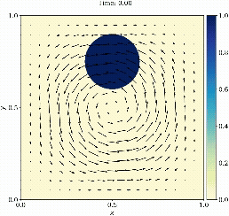

## PECANN-CAPU: Physics and Equality Constrained Artificial Neural Networks with the Conditionally Adaptive Penalty Update Algorithm


### Abstract:
This version introduces several key advances to the original Physics and Equality Constrained Artificial Neural Networks (PECANN) ####[framework](https://doi.org/10.1016/j.jcp.2022.111301), substantially improving its capacity and efficiency to solve challenging partial differential equations (PDEs). First, we generalize the Augmented Lagrangian Method (ALM) to support multiple, independent penalty parameters for enforcing heterogeneous constraints. Second, we introduce a constraint aggregation technique to address inefficiencies associated with point-wise enforcement of PDE constraints. Third, we incorporate a single Fourier feature mapping to capture highly oscillatory solutions with multi-scale features, where alternative physics-informed methods often require multiple mappings or costlier architectures. Fourth, a novel time-windowing strategy enables seamless long-time evolution of transport equations without relying on discrete time models. Fifth, and critically, we propose a conditionally adaptive penalty update (CAPU) strategy for ALM that accelerates the growth of Lagrange multipliers for constraints with larger violations, while enabling coordinated updates of multiple penalty parameters. We demonstrate the effectiveness of PECANN-CAPU across diverse problems, including the transonic rarefaction problem, reversible scalar advection by a vortex, Helmholtz and Poisson's equations with high wavenumber solutions, and inverse heat source identification. The framework achieves competitive accuracy across all cases when compared with established methods and recent approaches based on Kolmogorov-Arnold networks. An important implication of our investigation is that pure regression is insufficient to evaluate network architecture in physics-informed learning. Collectively, these advances improve the robustness, computational efficiency, and applicability of PECANN to demanding problems in scientific computing.
#### [Paper link] 

## Codes:
Jupyter notebooks are self-contained. 

##### Required packages
* PyTorch
* numpy 
* scipy 
* matplotlib


## Citation
Please cite us if you find our work useful for your research:
```

```
### Funding Acknowledgment
This material is based upon work supported by the National Science Foundation under Grant No. 1953204 and in part in part by the University of Pittsburgh Center for Research Computing through the resources provided.\
 
### Questions and feedback?
For questions or feedback feel free to reach us at [Inanc Senocak](mailto:senocak@pitt.edu), [Shams Basir](mailto:shamsbasir@gmail.com)
